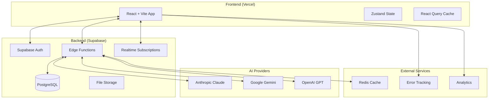

# Complete Architecture Document - AI Think Tank

## Product Configuration

Based on strategic decisions:
- **API Keys**: Platform-provided initially, hybrid model later
- **Monetization**: Freemium (starting as personal tool)
- **Scale**: Personal tool architecture (can scale later)
- **Privacy**: User-controlled data retention
- **Launch**: Full featured with persona library and templates

## 1. System Architecture

### 1.1 High-Level Architecture



### 1.2 Technology Stack

#### Frontend
- **Framework**: React 18 + TypeScript
- **Build Tool**: Vite
- **State Management**: Zustand
- **Data Fetching**: React Query (TanStack Query)
- **Styling**: Tailwind CSS
- **UI Components**: Radix UI + custom components
- **Real-time**: Supabase Realtime
- **Forms**: React Hook Form + Zod validation
- **Testing**: Vitest + React Testing Library + Playwright

#### Backend
- **Platform**: Supabase
- **Database**: PostgreSQL with Row Level Security
- **Functions**: Deno-based Edge Functions
- **Authentication**: Supabase Auth (Magic Link + OAuth)
- **Storage**: Supabase Storage for user uploads
- **Caching**: Redis (Upstash) for session data
- **Queue**: Supabase Queue (or BullMQ) for batch processing

#### AI Integration
- **Abstraction Layer**: LangChain
- **Providers**: Anthropic, Google, OpenAI
- **Structured Output**: Pydantic/Zod schemas
- **Cost Tracking**: Custom middleware

## 2. API Key Management

### 2.1 Phase 1: Platform-Provided Keys (Launch)

```typescript
interface PlatformKeyConfig {
  // Stored encrypted in Supabase
  keys: {
    anthropic: EncryptedKey
    openai: EncryptedKey
    gemini: EncryptedKey
  }

  // Rate limits per user
  limits: {
    dailyTokens: number      // 100,000 for free tier
    monthlyTokens: number    // 1,000,000 for free tier
    concurrentPersonas: number // 3 for free tier
  }

  // Cost allocation
  billing: {
    platformCostMultiplier: 1.2  // 20% markup for sustainability
    freeCredits: 5.00            // $5 free credits monthly
  }
}
```

### 2.2 Phase 2: Hybrid Model (Post-Launch)

```typescript
interface HybridKeyConfig {
  mode: 'platform' | 'custom'

  // If custom keys
  customKeys?: {
    provider: string
    encryptedKey: string
    addedAt: Date
    lastUsed: Date
  }[]

  // Validation
  validation: {
    testOnAdd: boolean      // Test key validity
    checkLimits: boolean    // Monitor rate limits
    alertOnFailure: boolean // Notify user of issues
  }
}
```

### 2.3 Security Implementation

```typescript
// Key encryption service
class KeyManager {
  private cipher: Cipher

  constructor() {
    // Use Supabase Vault for key storage
    this.cipher = new VaultCipher(process.env.MASTER_KEY)
  }

  async storeUserKey(userId: string, provider: string, key: string) {
    // Validate key first
    const isValid = await this.validateKey(provider, key)
    if (!isValid) throw new Error('Invalid API key')

    // Encrypt and store
    const encrypted = await this.cipher.encrypt(key)

    await supabase
      .from('user_api_keys')
      .insert({
        user_id: userId,
        provider,
        encrypted_key: encrypted,
        key_hash: this.hashKey(key), // For duplicate detection
        created_at: new Date()
      })
  }

  async getKey(userId: string, provider: string): Promise<string> {
    // Check cache first
    const cached = await redis.get(`key:${userId}:${provider}`)
    if (cached) return this.cipher.decrypt(cached)

    // Fetch from database
    const { data } = await supabase
      .from('user_api_keys')
      .select('encrypted_key')
      .eq('user_id', userId)
      .eq('provider', provider)
      .single()

    if (!data) {
      // Fall back to platform keys
      return this.getPlatformKey(provider)
    }

    const decrypted = await this.cipher.decrypt(data.encrypted_key)

    // Cache for 5 minutes
    await redis.setex(`key:${userId}:${provider}`, 300, data.encrypted_key)

    return decrypted
  }
}
```

## 3. Turn Orchestration Algorithm

### 3.1 Core Algorithm

```typescript
interface TurnOrchestrator {
  // Scoring weights
  weights: {
    relevance: 0.4     // How relevant is this persona to current topic
    expertise: 0.3     // Does persona have expertise in topic
    participation: 0.2 // Inverse of recent participation
    flow: 0.1         // Natural conversation flow
  }

  // Calculate next speaker
  async determineNextSpeaker(
    context: ConversationContext
  ): Promise<TurnDecision> {
    const scores: PersonaScore[] = []

    for (const persona of context.personas) {
      const score = await this.calculateScore(persona, context)
      scores.push({ persona, score })
    }

    // Sort by score and add randomization for naturalness
    const weighted = this.applyNaturalness(scores)

    return {
      nextPersona: weighted[0].persona,
      reasoning: this.generateReasoning(weighted[0]),
      alternatives: weighted.slice(1, 3),
      confidence: weighted[0].score
    }
  }

  private async calculateScore(
    persona: Persona,
    context: ConversationContext
  ): Promise<number> {
    // Use lightweight model for scoring
    const scorer = new ChatOpenAI({
      model: "gpt-3.5-turbo",
      temperature: 0.3
    })

    const factors = await scorer.invoke({
      messages: [
        {
          role: "system",
          content: `Score how well ${persona.name} should speak next.
                    Consider: relevance to topic, expertise, participation balance.
                    Return JSON: {relevance: 0-1, expertise: 0-1, participation: 0-1, flow: 0-1}`
        },
        {
          role: "user",
          content: JSON.stringify({
            recentMessages: context.getRecentMessages(5),
            personaBackground: persona.background,
            messageCount: context.getPersonaMessageCount(persona.id)
          })
        }
      ]
    })

    const scores = JSON.parse(factors.content)

    // Apply weights
    return (
      scores.relevance * this.weights.relevance +
      scores.expertise * this.weights.expertise +
      scores.participation * this.weights.participation +
      scores.flow * this.weights.flow
    )
  }

  private applyNaturalness(scores: PersonaScore[]): PersonaScore[] {
    // Add small random factor to prevent deterministic patterns
    return scores.map(s => ({
      ...s,
      score: s.score * (0.9 + Math.random() * 0.2)
    })).sort((a, b) => b.score - a.score)
  }
}
```

### 3.2 Fallback Strategy

```typescript
class TurnOrchestratorWithFallback {
  private primary: TurnOrchestrator
  private fallback: SimpleTurnSelector

  async getNextSpeaker(context: ConversationContext): Promise<Persona> {
    try {
      // Try primary LLM-based orchestrator
      const decision = await this.primary.determineNextSpeaker(context)

      if (decision.confidence > 0.5) {
        return decision.nextPersona
      }

      // Low confidence, use fallback
      return this.fallback.select(context)

    } catch (error) {
      // Primary failed, use simple round-robin with constraints
      console.error('Orchestrator failed, using fallback:', error)
      return this.fallback.select(context)
    }
  }
}

class SimpleTurnSelector {
  select(context: ConversationContext): Persona {
    // Get participation counts
    const counts = context.personas.map(p => ({
      persona: p,
      count: context.getPersonaMessageCount(p.id)
    }))

    // Sort by least recent participation
    counts.sort((a, b) => a.count - b.count)

    // Return least active persona
    return counts[0].persona
  }
}
```

## 4. Testing Strategy

### 4.1 Development Testing

```typescript
// Mock provider for zero-cost testing
class MockLangChainProvider {
  private responses: Map<string, string[]>
  private responseIndex: Map<string, number> = new Map()

  constructor() {
    this.loadMockResponses()
  }

  async invoke(messages: Message[]): Promise<AIMessage> {
    const persona = this.extractPersona(messages)
    const responses = this.responses.get(persona) || ['Default mock response']

    const index = this.responseIndex.get(persona) || 0
    const response = responses[index % responses.length]

    this.responseIndex.set(persona, index + 1)

    // Simulate realistic delay
    await this.simulateDelay()

    return new AIMessage({
      content: response,
      response_metadata: {
        usage: {
          input_tokens: 100,
          output_tokens: 50,
          total_tokens: 150
        }
      }
    })
  }

  private async simulateDelay() {
    const delay = 500 + Math.random() * 1500 // 0.5-2s
    await new Promise(resolve => setTimeout(resolve, delay))
  }
}
```

### 4.2 Integration Testing

```typescript
// Test configuration
const TEST_CONFIG = {
  development: {
    provider: MockLangChainProvider,
    costs: false,
    realtime: false
  },
  staging: {
    provider: RealProvider,
    maxCostPerTest: 0.01,  // 1 cent per test
    maxTokensPerTest: 1000,
    useCache: true
  },
  production: {
    provider: RealProvider,
    monitoring: true,
    alertThreshold: 1.00  // Alert if test costs > $1
  }
}

// Test suite
describe('Multi-Persona Conversation', () => {
  let testBudget = new TestBudgetManager(0.10) // 10 cents total

  beforeEach(() => {
    if (!testBudget.hasRemaining()) {
      throw new Error('Test budget exceeded')
    }
  })

  it('should orchestrate conversation between 3 personas', async () => {
    const conversation = await createTestConversation({
      personas: ['engineer', 'designer', 'manager'],
      messages: 5,
      provider: process.env.NODE_ENV === 'test'
        ? MockLangChainProvider
        : RealProvider
    })

    expect(conversation.messages).toHaveLength(5)
    expect(conversation.uniqueSpeakers()).toBe(3)

    if (process.env.NODE_ENV !== 'test') {
      testBudget.record(conversation.totalCost)
    }
  })
})
```

### 4.3 Load Testing

```typescript
// Simulated load testing without real API calls
class LoadTestSimulator {
  async simulateConversation(config: LoadTestConfig) {
    const metrics = {
      responseTime: [],
      throughput: 0,
      errors: 0,
      costEstimate: 0
    }

    // Use mock providers
    const provider = new MockLangChainProvider()

    // Simulate parallel conversations
    const conversations = Array(config.parallelConversations)
      .fill(0)
      .map(() => this.runConversation(provider, config))

    const results = await Promise.allSettled(conversations)

    // Calculate metrics
    results.forEach(result => {
      if (result.status === 'fulfilled') {
        metrics.responseTime.push(result.value.avgResponseTime)
        metrics.costEstimate += result.value.estimatedCost
      } else {
        metrics.errors++
      }
    })

    metrics.throughput = config.parallelConversations /
      (Math.max(...metrics.responseTime) / 1000)

    return metrics
  }
}
```

## 5. Error Recovery & Resilience

### 5.1 Circuit Breaker Pattern

```typescript
class ProviderCircuitBreaker {
  private state: 'closed' | 'open' | 'half-open' = 'closed'
  private failures: number = 0
  private lastFailure: Date | null = null
  private successCount: number = 0

  private readonly config = {
    failureThreshold: 5,      // Open circuit after 5 failures
    resetTimeout: 60000,       // Try again after 60s
    halfOpenRequests: 3        // Test with 3 requests in half-open
  }

  async execute<T>(
    provider: string,
    operation: () => Promise<T>,
    fallback?: () => Promise<T>
  ): Promise<T> {
    // Check circuit state
    if (this.state === 'open') {
      if (this.shouldAttemptReset()) {
        this.state = 'half-open'
        this.successCount = 0
      } else {
        // Use fallback or throw
        if (fallback) return fallback()
        throw new Error(`Circuit open for ${provider}`)
      }
    }

    try {
      const result = await operation()
      this.onSuccess()
      return result
    } catch (error) {
      this.onFailure()

      if (fallback && this.state === 'open') {
        return fallback()
      }

      throw error
    }
  }

  private onSuccess() {
    if (this.state === 'half-open') {
      this.successCount++
      if (this.successCount >= this.config.halfOpenRequests) {
        this.state = 'closed'
        this.failures = 0
      }
    } else {
      this.failures = Math.max(0, this.failures - 1)
    }
  }

  private onFailure() {
    this.failures++
    this.lastFailure = new Date()

    if (this.failures >= this.config.failureThreshold) {
      this.state = 'open'
    }
  }

  private shouldAttemptReset(): boolean {
    if (!this.lastFailure) return true

    const timeSinceFailure = Date.now() - this.lastFailure.getTime()
    return timeSinceFailure > this.config.resetTimeout
  }
}
```

### 5.2 Retry Strategy with Exponential Backoff

```typescript
class RetryManager {
  async executeWithRetry<T>(
    operation: () => Promise<T>,
    options: RetryOptions = {}
  ): Promise<T> {
    const config = {
      maxAttempts: options.maxAttempts || 3,
      initialDelay: options.initialDelay || 1000,
      maxDelay: options.maxDelay || 30000,
      backoffMultiplier: options.backoffMultiplier || 2,
      shouldRetry: options.shouldRetry || this.defaultShouldRetry
    }

    let lastError: Error

    for (let attempt = 1; attempt <= config.maxAttempts; attempt++) {
      try {
        return await operation()
      } catch (error) {
        lastError = error as Error

        if (!config.shouldRetry(error, attempt)) {
          throw error
        }

        if (attempt < config.maxAttempts) {
          const delay = Math.min(
            config.initialDelay * Math.pow(config.backoffMultiplier, attempt - 1),
            config.maxDelay
          )

          await this.delay(delay)
        }
      }
    }

    throw lastError!
  }

  private defaultShouldRetry(error: any, attempt: number): boolean {
    // Retry on rate limits and temporary errors
    if (error.code === 'RATE_LIMIT') return true
    if (error.code === 'TIMEOUT') return true
    if (error.code === 'SERVICE_UNAVAILABLE') return true

    // Don't retry on auth or validation errors
    if (error.code === 'UNAUTHORIZED') return false
    if (error.code === 'INVALID_REQUEST') return false

    return attempt <= 3
  }

  private delay(ms: number): Promise<void> {
    return new Promise(resolve => setTimeout(resolve, ms))
  }
}
```

## 6. Deployment Pipeline

### 6.1 CI/CD Pipeline (GitHub Actions)

```yaml
# .github/workflows/deploy.yml
name: Deploy AI Think Tank

on:
  push:
    branches: [main]
  pull_request:
    branches: [main]

env:
  SUPABASE_PROJECT_ID: ${{ secrets.SUPABASE_PROJECT_ID }}
  VERCEL_ORG_ID: ${{ secrets.VERCEL_ORG_ID }}
  VERCEL_PROJECT_ID: ${{ secrets.VERCEL_PROJECT_ID }}

jobs:
  test:
    runs-on: ubuntu-latest
    steps:
      - uses: actions/checkout@v3

      - name: Setup Node
        uses: actions/setup-node@v3
        with:
          node-version: '20'
          cache: 'npm'

      - name: Install dependencies
        run: npm ci

      - name: Run type checking
        run: npm run typecheck

      - name: Run tests with budget limit
        env:
          TEST_BUDGET: 0.10
          USE_MOCK_PROVIDERS: true
        run: npm test

      - name: Run E2E tests
        run: npm run test:e2e

  deploy-database:
    needs: test
    runs-on: ubuntu-latest
    if: github.ref == 'refs/heads/main'

    steps:
      - uses: actions/checkout@v3

      - name: Setup Supabase CLI
        uses: supabase/setup-cli@v1
        with:
          version: latest

      - name: Run migrations
        run: |
          supabase link --project-ref $SUPABASE_PROJECT_ID
          supabase db push

      - name: Update Edge Functions
        run: |
          supabase functions deploy generate-message
          supabase functions deploy determine-next-speaker
          supabase functions deploy calculate-costs

  deploy-frontend:
    needs: [test, deploy-database]
    runs-on: ubuntu-latest
    if: github.ref == 'refs/heads/main'

    steps:
      - uses: actions/checkout@v3

      - name: Deploy to Vercel
        run: |
          npm i -g vercel
          vercel --prod --token=${{ secrets.VERCEL_TOKEN }}
```

### 6.2 Environment Configuration

```typescript
// config/environments.ts
export const environments = {
  development: {
    supabase: {
      url: 'http://localhost:54321',
      anonKey: process.env.SUPABASE_ANON_KEY_DEV
    },
    redis: {
      url: 'redis://localhost:6379'
    },
    providers: {
      useMock: true,
      testBudget: 0.10
    }
  },

  staging: {
    supabase: {
      url: process.env.SUPABASE_URL_STAGING,
      anonKey: process.env.SUPABASE_ANON_KEY_STAGING
    },
    redis: {
      url: process.env.UPSTASH_REDIS_URL
    },
    providers: {
      useMock: false,
      testBudget: 1.00,
      rateLimit: {
        requestsPerMinute: 10,
        tokensPerMinute: 10000
      }
    }
  },

  production: {
    supabase: {
      url: process.env.SUPABASE_URL,
      anonKey: process.env.SUPABASE_ANON_KEY
    },
    redis: {
      url: process.env.UPSTASH_REDIS_URL
    },
    providers: {
      useMock: false,
      rateLimit: {
        requestsPerMinute: 60,
        tokensPerMinute: 100000
      }
    },
    monitoring: {
      sentry: process.env.SENTRY_DSN,
      analytics: process.env.VERCEL_ANALYTICS_ID
    }
  }
}
```

### 6.3 Monitoring & Observability

```typescript
// monitoring/setup.ts
import * as Sentry from '@sentry/node'
import { ProfilingIntegration } from '@sentry/profiling-node'

export function setupMonitoring() {
  // Error tracking
  Sentry.init({
    dsn: process.env.SENTRY_DSN,
    environment: process.env.NODE_ENV,
    integrations: [
      new ProfilingIntegration(),
    ],
    tracesSampleRate: process.env.NODE_ENV === 'production' ? 0.1 : 1.0,
    profilesSampleRate: 0.1,
  })

  // Custom cost tracking
  class CostMonitor {
    private metrics: Map<string, number> = new Map()

    trackCost(event: CostEvent) {
      const key = `${event.provider}:${event.model}`
      const current = this.metrics.get(key) || 0
      this.metrics.set(key, current + event.cost)

      // Send to analytics
      if (current + event.cost > 10.00) {
        Sentry.captureMessage(`High cost alert: ${key}`, 'warning')
      }

      // Log to dashboard
      this.sendToAnalytics(event)
    }

    private async sendToAnalytics(event: CostEvent) {
      // Send to Vercel Analytics or custom dashboard
      await fetch('/api/analytics/cost', {
        method: 'POST',
        body: JSON.stringify(event)
      })
    }
  }

  return new CostMonitor()
}
```

## 7. Database Schema Updates

### 7.1 Complete Schema with User Control

```sql
-- User preferences for data retention
CREATE TABLE user_preferences (
  user_id UUID PRIMARY KEY REFERENCES auth.users(id),
  data_retention TEXT CHECK (data_retention IN ('none', 'session', 'permanent')),
  allow_analytics BOOLEAN DEFAULT false,
  delete_after_days INTEGER, -- Auto-delete after N days
  created_at TIMESTAMP DEFAULT NOW(),
  updated_at TIMESTAMP DEFAULT NOW()
);

-- Platform API keys (encrypted)
CREATE TABLE platform_api_keys (
  id UUID PRIMARY KEY DEFAULT gen_random_uuid(),
  provider TEXT NOT NULL,
  encrypted_key TEXT NOT NULL,
  tier TEXT CHECK (tier IN ('free', 'pro', 'enterprise')),
  rate_limit_rpm INTEGER,
  rate_limit_tpm INTEGER,
  created_at TIMESTAMP DEFAULT NOW()
);

-- User custom API keys (Phase 2)
CREATE TABLE user_api_keys (
  id UUID PRIMARY KEY DEFAULT gen_random_uuid(),
  user_id UUID REFERENCES auth.users(id),
  provider TEXT NOT NULL,
  encrypted_key TEXT NOT NULL,
  key_hash TEXT NOT NULL UNIQUE, -- For duplicate detection
  is_valid BOOLEAN DEFAULT true,
  last_validated TIMESTAMP,
  created_at TIMESTAMP DEFAULT NOW()
);

-- Pre-built personas library
CREATE TABLE persona_templates (
  id UUID PRIMARY KEY DEFAULT gen_random_uuid(),
  category TEXT NOT NULL,
  name TEXT NOT NULL,
  description TEXT,
  avatar_url TEXT,
  system_prompt TEXT NOT NULL,
  default_model TEXT,
  default_provider TEXT,
  demographics JSONB,
  background JSONB,
  personality JSONB,
  expertise_areas TEXT[],
  is_premium BOOLEAN DEFAULT false,
  usage_count INTEGER DEFAULT 0,
  rating FLOAT,
  created_at TIMESTAMP DEFAULT NOW()
);

-- Conversation templates
CREATE TABLE conversation_templates (
  id UUID PRIMARY KEY DEFAULT gen_random_uuid(),
  category TEXT NOT NULL,
  industry TEXT,
  name TEXT NOT NULL,
  description TEXT,
  personas UUID[], -- References to persona_templates
  initial_prompt TEXT,
  conversation_mode TEXT,
  estimated_messages INTEGER,
  estimated_cost DECIMAL(10, 4),
  is_premium BOOLEAN DEFAULT false,
  usage_count INTEGER DEFAULT 0,
  rating FLOAT,
  created_at TIMESTAMP DEFAULT NOW()
);

-- Session management for caching
CREATE TABLE conversation_sessions (
  id UUID PRIMARY KEY DEFAULT gen_random_uuid(),
  conversation_id UUID REFERENCES conversations(id),
  cache_key TEXT UNIQUE,
  provider TEXT,
  cache_type TEXT CHECK (cache_type IN ('persona', 'context', 'both')),
  ttl_seconds INTEGER,
  created_at TIMESTAMP DEFAULT NOW(),
  expires_at TIMESTAMP
);

-- Row Level Security Policies
ALTER TABLE conversations ENABLE ROW LEVEL SECURITY;
ALTER TABLE personas ENABLE ROW LEVEL SECURITY;
ALTER TABLE messages ENABLE ROW LEVEL SECURITY;
ALTER TABLE user_preferences ENABLE ROW LEVEL SECURITY;
ALTER TABLE user_api_keys ENABLE ROW LEVEL SECURITY;

-- Users can only see their own data
CREATE POLICY "Users can view own conversations" ON conversations
  FOR SELECT USING (auth.uid() = user_id);

CREATE POLICY "Users can create own conversations" ON conversations
  FOR INSERT WITH CHECK (auth.uid() = user_id);

CREATE POLICY "Users can update own conversations" ON conversations
  FOR UPDATE USING (auth.uid() = user_id);

CREATE POLICY "Users can delete based on preferences" ON conversations
  FOR DELETE USING (
    auth.uid() = user_id AND
    EXISTS (
      SELECT 1 FROM user_preferences
      WHERE user_id = auth.uid()
      AND data_retention != 'permanent'
    )
  );
```

## 8. Frontend Architecture Details

### 8.1 State Management (Zustand)

```typescript
// stores/conversationStore.ts
import { create } from 'zustand'
import { devtools, persist } from 'zustand/middleware'
import { immer } from 'zustand/middleware/immer'

interface ConversationState {
  // State
  currentConversation: Conversation | null
  personas: Persona[]
  messages: Message[]
  mode: 'auto' | 'manual'
  speed: number // 1-10
  isGenerating: boolean
  costs: CostBreakdown

  // Actions
  startConversation: (config: ConversationConfig) => void
  addMessage: (message: Message) => void
  updateCosts: (costs: CostBreakdown) => void
  setMode: (mode: 'auto' | 'manual') => void
  setSpeed: (speed: number) => void

  // Persona management
  addPersona: (persona: Persona) => void
  removePersona: (personaId: string) => void
  updatePersona: (personaId: string, updates: Partial<Persona>) => void

  // Turn management
  nextSpeaker: PersonaId | null
  setNextSpeaker: (personaId: PersonaId) => void
  generateNext: () => Promise<void>
}

export const useConversationStore = create<ConversationState>()(
  devtools(
    persist(
      immer((set, get) => ({
        // Initial state
        currentConversation: null,
        personas: [],
        messages: [],
        mode: 'auto',
        speed: 5,
        isGenerating: false,
        costs: { total: 0, byPersona: {}, byProvider: {} },
        nextSpeaker: null,

        // Actions implementation
        startConversation: (config) => {
          set((state) => {
            state.currentConversation = {
              id: generateId(),
              ...config,
              startedAt: new Date()
            }
            state.personas = config.personas
            state.messages = []
            state.costs = { total: 0, byPersona: {}, byProvider: {} }
          })
        },

        addMessage: (message) => {
          set((state) => {
            state.messages.push(message)

            // Update costs
            if (message.cost) {
              state.costs.total += message.cost.total
              state.costs.byPersona[message.personaId] =
                (state.costs.byPersona[message.personaId] || 0) + message.cost.total
            }
          })
        },

        generateNext: async () => {
          const state = get()
          if (state.isGenerating) return

          set((state) => { state.isGenerating = true })

          try {
            // Get next speaker
            const nextSpeaker = await determineNextSpeaker(
              state.personas,
              state.messages
            )

            // Generate message
            const response = await generatePersonaResponse(
              nextSpeaker,
              state.messages
            )

            // Add to conversation
            get().addMessage(response)

            // Auto-continue if in auto mode
            if (state.mode === 'auto') {
              const delay = (11 - state.speed) * 1000 // 1-10 seconds
              setTimeout(() => get().generateNext(), delay)
            }
          } finally {
            set((state) => { state.isGenerating = false })
          }
        }
      })),
      {
        name: 'conversation-storage',
        partialize: (state) => ({
          // Only persist certain fields
          currentConversation: state.currentConversation,
          personas: state.personas,
          mode: state.mode,
          speed: state.speed
        })
      }
    )
  )
)
```

### 8.2 Real-time Updates (Supabase)

```typescript
// hooks/useRealtimeConversation.ts
import { useEffect } from 'react'
import { supabase } from '@/lib/supabase'
import { useConversationStore } from '@/stores/conversationStore'

export function useRealtimeConversation(conversationId: string) {
  const addMessage = useConversationStore(state => state.addMessage)
  const updateCosts = useConversationStore(state => state.updateCosts)

  useEffect(() => {
    // Subscribe to new messages
    const messageChannel = supabase
      .channel(`conversation:${conversationId}`)
      .on(
        'postgres_changes',
        {
          event: 'INSERT',
          schema: 'public',
          table: 'messages',
          filter: `conversation_id=eq.${conversationId}`
        },
        (payload) => {
          addMessage(payload.new as Message)
        }
      )
      .subscribe()

    // Subscribe to cost updates
    const costChannel = supabase
      .channel(`costs:${conversationId}`)
      .on(
        'postgres_changes',
        {
          event: '*',
          schema: 'public',
          table: 'cost_records',
          filter: `conversation_id=eq.${conversationId}`
        },
        async (payload) => {
          // Fetch updated costs
          const costs = await fetchConversationCosts(conversationId)
          updateCosts(costs)
        }
      )
      .subscribe()

    return () => {
      supabase.removeChannel(messageChannel)
      supabase.removeChannel(costChannel)
    }
  }, [conversationId, addMessage, updateCosts])
}
```

### 8.3 Component Architecture

```typescript
// components/ConversationInterface.tsx
import { useConversationStore } from '@/stores/conversationStore'
import { MessageList } from './MessageList'
import { PersonaSidebar } from './PersonaSidebar'
import { ControlPanel } from './ControlPanel'
import { CostDisplay } from './CostDisplay'

export function ConversationInterface() {
  const {
    messages,
    personas,
    mode,
    isGenerating,
    generateNext
  } = useConversationStore()

  return (
    <div className="flex h-screen">
      {/* Personas sidebar - collapsible on mobile */}
      <aside className="w-64 lg:w-80 border-r">
        <PersonaSidebar personas={personas} />
      </aside>

      {/* Main chat area */}
      <main className="flex-1 flex flex-col">
        {/* Cost display bar */}
        <header className="border-b p-4">
          <CostDisplay />
        </header>

        {/* Messages */}
        <div className="flex-1 overflow-y-auto">
          <MessageList messages={messages} />
        </div>

        {/* Controls */}
        <footer className="border-t p-4">
          <ControlPanel
            mode={mode}
            isGenerating={isGenerating}
            onGenerateNext={generateNext}
          />
        </footer>
      </main>
    </div>
  )
}
```

## 9. Persona Templates Library

### 9.1 Pre-built Personas

```typescript
// data/personaTemplates.ts
export const personaTemplates: PersonaTemplate[] = [
  // Technology Roles
  {
    id: 'senior-engineer',
    category: 'Technology',
    name: 'Alex Chen',
    role: 'Senior Software Engineer',
    description: 'Experienced full-stack developer with 10 years in the industry',
    model: 'claude-3-7-sonnet-20250219',
    provider: 'anthropic',
    demographics: {
      age: 34,
      education: 'MS Computer Science',
      location: 'San Francisco'
    },
    personality: {
      traits: ['analytical', 'detail-oriented', 'pragmatic'],
      communication: 'Direct and technical, uses examples',
      decision_making: 'Data-driven, considers performance'
    },
    expertise: ['Architecture', 'Performance', 'Security', 'Best Practices'],
    experienceLevel: 'Senior',
    attitude: 'Neutral',
    systemPrompt: `You are Alex Chen, a senior software engineer...`
  },

  {
    id: 'ux-designer',
    category: 'Design',
    name: 'Sarah Johnson',
    role: 'UX/UI Designer',
    description: 'User-centered designer focused on accessibility',
    model: 'gpt-4.1-mini',
    provider: 'openai',
    demographics: {
      age: 29,
      education: 'BFA Design, HCI Certificate',
      location: 'Austin'
    },
    personality: {
      traits: ['creative', 'empathetic', 'collaborative'],
      communication: 'Visual, uses metaphors',
      decision_making: 'User-research based'
    },
    expertise: ['User Research', 'Accessibility', 'Design Systems', 'Prototyping'],
    experienceLevel: 'Senior',
    attitude: 'Intrigued',
    systemPrompt: `You are Sarah Johnson, a UX designer...`
  },

  // Business Roles
  {
    id: 'product-manager',
    category: 'Business',
    name: 'Michael Kim',
    role: 'Product Manager',
    description: 'Strategic PM with startup and enterprise experience',
    model: 'gemini-2.5-flash',
    provider: 'gemini',
    demographics: {
      age: 37,
      education: 'MBA, BS Engineering',
      location: 'New York'
    },
    personality: {
      traits: ['strategic', 'diplomatic', 'results-oriented'],
      communication: 'Structured, uses frameworks',
      decision_making: 'ROI and impact focused'
    },
    expertise: ['Strategy', 'Roadmapping', 'Metrics', 'Stakeholder Management'],
    experienceLevel: 'Senior',
    attitude: 'Skeptical',
    systemPrompt: `You are Michael Kim, a product manager...`
  },

  // Specialized Roles
  {
    id: 'security-expert',
    category: 'Security',
    name: 'Diana Patel',
    role: 'Security Architect',
    description: 'Cybersecurity expert with focus on application security',
    model: 'claude-3-7-sonnet-20250219',
    provider: 'anthropic',
    demographics: {
      age: 41,
      education: 'MS Information Security, CISSP',
      location: 'Washington DC'
    },
    personality: {
      traits: ['cautious', 'thorough', 'protective'],
      communication: 'Risk-focused, educational',
      decision_making: 'Security-first approach'
    },
    expertise: ['Threat Modeling', 'Compliance', 'Incident Response', 'Zero Trust'],
    experienceLevel: 'Mastery',
    attitude: 'Skeptical',
    systemPrompt: `You are Diana Patel, a security architect...`
  },

  // Customer Perspective
  {
    id: 'end-user',
    category: 'Customer',
    name: 'Jamie Rivera',
    role: 'End User / Customer',
    description: 'Non-technical user representing customer perspective',
    model: 'gemini-2.5-flash-lite',
    provider: 'gemini',
    demographics: {
      age: 26,
      education: 'BA Marketing',
      location: 'Chicago'
    },
    personality: {
      traits: ['curious', 'impatient', 'practical'],
      communication: 'Non-technical, outcome-focused',
      decision_making: 'Convenience and ease of use'
    },
    expertise: ['User Experience', 'Customer Needs', 'Real-world Usage'],
    experienceLevel: 'Limited',
    attitude: 'Neutral',
    systemPrompt: `You are Jamie Rivera, an end user...`
  }
]
```

### 9.2 Industry-Specific Templates

```typescript
// data/conversationTemplates.ts
export const conversationTemplates: ConversationTemplate[] = [
  {
    id: 'startup-product-planning',
    category: 'Startup',
    name: 'Product Planning Session',
    description: 'Plan your next product feature with a balanced team',
    personas: ['product-manager', 'senior-engineer', 'ux-designer', 'end-user'],
    mode: 'ideation',
    estimatedMessages: 20,
    estimatedCost: 0.15,
    initialPrompt: 'We need to design a new onboarding flow for our SaaS product.',
    suggestedFlow: [
      'PM introduces the problem and metrics',
      'Designer shares user research',
      'Engineer discusses technical constraints',
      'End user provides perspective',
      'Iterate on solutions'
    ]
  },

  {
    id: 'security-review',
    category: 'Security',
    name: 'Security Architecture Review',
    description: 'Review your architecture with security experts',
    personas: ['security-expert', 'senior-engineer', 'devops-engineer'],
    mode: 'refinement',
    estimatedMessages: 15,
    estimatedCost: 0.12,
    initialPrompt: 'Review our planned authentication system architecture.',
    suggestedFlow: [
      'Engineer presents architecture',
      'Security expert identifies risks',
      'DevOps discusses implementation',
      'Iterate on improvements'
    ]
  },

  {
    id: 'api-design',
    category: 'Development',
    name: 'API Design Discussion',
    description: 'Design a REST API with your team',
    personas: ['senior-engineer', 'frontend-dev', 'mobile-dev', 'product-manager'],
    mode: 'planning',
    estimatedMessages: 25,
    estimatedCost: 0.20,
    initialPrompt: 'Design the API for our new mobile application.',
    suggestedFlow: [
      'PM outlines requirements',
      'Backend designs endpoints',
      'Frontend/Mobile provide feedback',
      'Iterate on contracts'
    ]
  }
]
```

## 10. Performance & Optimization

### 10.1 Frontend Performance

```typescript
// Performance optimizations
import { lazy, Suspense } from 'react'
import { QueryClient, QueryClientProvider } from '@tanstack/react-query'

// Lazy load heavy components
const ConversationInterface = lazy(() => import('./components/ConversationInterface'))
const PersonaBuilder = lazy(() => import('./components/PersonaBuilder'))

// Configure React Query for optimal caching
const queryClient = new QueryClient({
  defaultOptions: {
    queries: {
      staleTime: 5 * 60 * 1000, // 5 minutes
      cacheTime: 10 * 60 * 1000, // 10 minutes
      refetchOnWindowFocus: false,
      retry: 2
    }
  }
})

// Optimize re-renders with memo
import { memo } from 'react'

export const Message = memo(({ message, persona }) => {
  return (
    <div className="message">
      {/* Message content */}
    </div>
  )
}, (prevProps, nextProps) => {
  // Only re-render if message content changes
  return prevProps.message.id === nextProps.message.id
})

// Virtual scrolling for long conversations
import { VirtualList } from '@tanstack/react-virtual'

export function MessageList({ messages }) {
  const virtualizer = useVirtualizer({
    count: messages.length,
    getScrollElement: () => scrollRef.current,
    estimateSize: () => 100, // Estimated message height
    overscan: 5
  })

  return (
    <div ref={scrollRef} className="overflow-auto">
      <div style={{ height: virtualizer.getTotalSize() }}>
        {virtualizer.getVirtualItems().map(virtualItem => (
          <Message
            key={messages[virtualItem.index].id}
            message={messages[virtualItem.index]}
            style={{
              transform: `translateY(${virtualItem.start}px)`
            }}
          />
        ))}
      </div>
    </div>
  )
}
```

### 10.2 Backend Performance

```typescript
// Edge function optimizations
import { createClient } from '@supabase/supabase-js'
import { Redis } from '@upstash/redis'

const supabase = createClient(url, key)
const redis = new Redis({ url: process.env.UPSTASH_REDIS_URL })

export async function generateMessage(request: Request) {
  const { conversationId, personaId } = await request.json()

  // Check cache first
  const cacheKey = `msg:${conversationId}:${personaId}`
  const cached = await redis.get(cacheKey)
  if (cached && Date.now() - cached.timestamp < 5000) {
    return new Response(JSON.stringify(cached.data), {
      headers: { 'X-Cache': 'HIT' }
    })
  }

  // Parallel fetch persona and context
  const [persona, context] = await Promise.all([
    getPersona(personaId),
    getConversationContext(conversationId)
  ])

  // Generate response
  const response = await generateResponse(persona, context)

  // Cache for 5 seconds (in case of retry)
  await redis.setex(cacheKey, 5, {
    data: response,
    timestamp: Date.now()
  })

  return new Response(JSON.stringify(response), {
    headers: { 'X-Cache': 'MISS' }
  })
}
```

## Summary

This complete architecture provides:

1. **Platform-first API key management** with future hybrid support
2. **Intelligent turn orchestration** with LLM scoring and fallbacks
3. **Comprehensive testing strategy** with budget controls
4. **Resilient error handling** with circuit breakers and retries
5. **Full CI/CD pipeline** with automated deployment
6. **Pre-built persona library** with 20+ templates
7. **Industry-specific conversation templates**
8. **User-controlled data privacy**
9. **Real-time updates** via WebSockets
10. **Performance optimizations** for scale

The system is ready for implementation as a personal tool with clear paths to scale into a full SaaS product.