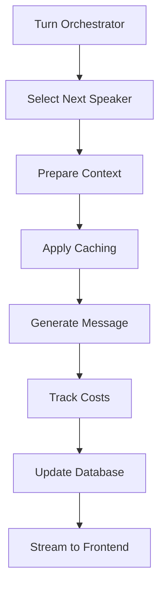

# Multi-Persona AI Conversation Simulator - Architecture Plan

## Overview
A team meeting/focus group simulator where multiple AI personas with distinct characteristics contribute to conversations. Each persona has defined demographics, backgrounds, personalities, and uses different AI models.

## 1. Core Architecture

### Technology Stack
- **Backend**: Node.js/TypeScript with Supabase Edge Functions
- **Frontend**: Vite + React with mobile-first responsive design
- **Database**: Supabase PostgreSQL
- **Authentication**: Supabase Auth
- **AI Integration**: LangChain as primary abstraction layer
- **Hosting**: Supabase for backend, Vercel/Netlify for frontend

## 2. AI Provider Integration Strategy

### Use LangChain for Multi-Provider Support
LangChain provides a unified interface for all providers, simplifying provider switching and reducing code complexity.

```typescript
// Unified interface examples
import { ChatOpenAI } from 'langchain_openai'
import { ChatAnthropic } from 'langchain_anthropic'
import { ChatGoogleGenerativeAI } from 'langchain_google_genai'
```

### Provider-Specific Features to Leverage

#### Anthropic Claude
- **Prompt Caching**: 5-minute and 1-hour TTL options
- **Cache Control**: Explicit cache_control blocks
- **Usage Tracking**: Detailed cache hit/miss metrics
- **Batch Processing**: Supported with caching

#### Google Gemini
- **Explicit Caching**: Create and manage cache objects
- **Structured Output**: responseSchema with JSON mode
- **Batch API**: Native Pydantic model support
- **Token Tracking**: Separate thoughts vs output tokens

#### OpenAI
- **Organization Cost API**: Real-time cost tracking endpoints
- **Structured Output**: json_schema support
- **Batch API**: 50% discount on batch processing
- **Usage Metrics**: Comprehensive token and cost tracking

## 3. Cost Management System

### Real-time Cost Tracking Architecture

#### Token Tracking per Message
```typescript
interface MessageCost {
  input_tokens: number
  output_tokens: number
  cached_tokens: number
  cache_write_tokens?: number
  total_cost: number
  breakdown: {
    input_cost: number
    output_cost: number
    cache_cost: number
  }
}
```

#### Database Schema
```sql
-- Conversations table
CREATE TABLE conversations (
  id UUID PRIMARY KEY,
  user_id UUID REFERENCES auth.users,
  title TEXT NOT NULL,
  topic TEXT,
  mode TEXT CHECK (mode IN ('auto', 'manual')),
  conversation_type TEXT CHECK (conversation_type IN ('debate', 'ideation', 'refinement', 'planning')),
  total_cost DECIMAL(10, 6),
  created_at TIMESTAMP DEFAULT NOW(),
  ended_at TIMESTAMP
);

-- Personas table
CREATE TABLE personas (
  id UUID PRIMARY KEY,
  conversation_id UUID REFERENCES conversations,
  name TEXT NOT NULL,
  model TEXT NOT NULL,
  provider TEXT NOT NULL,
  demographics JSONB,
  background JSONB,
  personality JSONB,
  experience_level TEXT,
  attitude TEXT,
  system_prompt TEXT,
  total_cost DECIMAL(10, 6),
  total_tokens_used INTEGER
);

-- Messages table
CREATE TABLE messages (
  id UUID PRIMARY KEY,
  conversation_id UUID REFERENCES conversations,
  persona_id UUID REFERENCES personas,
  content TEXT NOT NULL,
  tokens_input INTEGER,
  tokens_output INTEGER,
  tokens_cached INTEGER,
  cost DECIMAL(10, 6),
  created_at TIMESTAMP DEFAULT NOW()
);

-- User usage tracking
CREATE TABLE user_usage (
  user_id UUID REFERENCES auth.users,
  month DATE,
  total_cost DECIMAL(10, 6),
  total_tokens INTEGER,
  conversation_count INTEGER,
  PRIMARY KEY (user_id, month)
);
```

### Cost Calculation Service
- Real-time cost calculation based on models.yaml pricing
- Provider-specific pricing rules (caching, batch discounts)
- Monthly budget alerts and limits
- Cost breakdowns by persona, conversation, and time period

## 4. Intelligent Turn Management System

### LLM-based Turn Orchestrator

#### Architecture
```typescript
interface TurnDecision {
  next_persona_id: string
  reasoning: string
  priority_score: number
  factors: {
    relevance: number
    expertise: number
    participation_balance: number
    conversation_flow: number
  }
}
```

#### Implementation Strategy
- Use lightweight model (e.g., Claude Haiku 3.5) for efficiency
- Analyze last 5-10 messages for context
- Consider persona expertise and conversation type
- Ensure balanced participation over time
- Return structured output for predictability

### Turn Management Rules
1. **Relevance**: Prioritize personas with expertise in current topic
2. **Balance**: Ensure all personas contribute meaningfully
3. **Flow**: Maintain natural conversation patterns
4. **Context**: Consider conversation mode (debate vs ideation)
5. **User Priority**: Always allow user interruption

## 5. Caching Strategy

### Multi-Level Caching Architecture

#### System-Level Caching (1 hour TTL)
- Persona definitions and system prompts
- Common conversation starters
- Model configuration and parameters

#### Conversation-Level Caching (5 minute TTL)
- Recent conversation context
- Turn orchestrator context
- Shared knowledge base

#### Implementation by Provider

##### Anthropic Claude
```python
cache_control = {"type": "ephemeral"}  # 5-minute cache
messages = [
    {
        "role": "system",
        "content": persona_definition,
        "cache_control": cache_control
    }
]
```

##### Google Gemini
```python
cache = client.caches.create(
    model=model,
    config=CreateCachedContentConfig(
        system_instruction=persona_definition,
        contents=conversation_context,
        ttl="300s"  # 5 minutes
    )
)
```

## 6. Message Generation Pipeline

### Pipeline Steps



### Detailed Implementation

1. **Turn Orchestration**
   - Analyze conversation state
   - Determine next speaker
   - Return structured decision

2. **Context Preparation**
   - Load persona system prompt (cached)
   - Append conversation history (cached)
   - Add current context

3. **Message Generation**
   - Select appropriate model/provider
   - Apply structured output schema
   - Handle streaming response

4. **Cost Tracking**
   - Calculate token usage
   - Apply provider-specific pricing
   - Update running totals

5. **Database Updates**
   - Store message content
   - Record cost metrics
   - Update conversation state

## 7. Persona Management

### Persona Configuration Schema

```typescript
interface Persona {
  // Identity
  id: string
  name: string
  avatar?: string

  // AI Configuration
  model: AIModel
  provider: 'openai' | 'anthropic' | 'gemini'
  temperature?: number
  max_tokens?: number

  // Character Definition
  demographics: {
    age?: number
    gender?: string
    location?: string
    occupation?: string
    education?: string
  }

  background: {
    professional: string
    personal: string
    expertise: string[]
    interests: string[]
  }

  personality: {
    traits: string[]
    communication_style: string
    decision_making: string
    values: string[]
  }

  // Behavioral Parameters
  experienceLevel: 'None' | 'Limited' | 'Entry' | 'Senior' | 'Mastery'
  attitude: 'Pessimistic' | 'Skeptical' | 'Neutral' | 'Intrigued' | 'Excited'

  // Optional Overrides
  systemPrompt?: string
  customInstructions?: string
}
```

### Persona Templates
Pre-built personas for common roles:
- Technical Expert
- Business Strategist
- Creative Designer
- End User Representative
- Devil's Advocate
- Project Manager

## 8. Conversation Modes

### Available Modes

#### Auto Mode
- Automatic message generation
- Configurable speed (1-10 scale)
- Pause/resume functionality
- Background generation with queue

#### Manual Mode
- User triggers each message
- Preview next speaker
- Skip option available
- Edit before sending

### Conversation Types

#### Debate Mode
- Structured argumentation
- Point-counterpoint flow
- Fact-checking emphasis
- Clear position statements

#### Ideation Mode
- Building on ideas
- "Yes, and..." approach
- Creative exploration
- Minimal criticism

#### Refinement Mode
- Iterative improvement
- Constructive feedback
- Detail-oriented discussion
- Solution optimization

#### Planning Mode
- Task breakdown
- Timeline discussion
- Resource allocation
- Risk assessment

## 9. Frontend Components

### Core Components

#### ConferenceRoomSetup
- Room title and topic input
- Persona builder interface
- Template selection
- Quick start options

#### ChatInterface
- Message display (Slack/Discord style)
- Persona indicators and avatars
- Timestamp and cost per message
- Thread/reply support

#### CostDisplay
- Real-time cost counter
- Cost breakdown by persona
- Projection for full conversation
- Budget alerts

#### PersonaCard
- Visual representation
- Active/typing indicators
- Participation metrics
- Quick bio tooltip

#### ControlPanel
- Speed slider (auto mode)
- Mode switcher
- Conversation type selector
- Pause/resume/stop controls

### Mobile-First Design
- Responsive layouts
- Touch-optimized controls
- Collapsible sidebars
- Swipe gestures for navigation

## 10. Supabase Edge Functions

### Key Functions

#### `generate-message`
```typescript
interface GenerateMessageRequest {
  conversation_id: string
  persona_id: string
  context: Message[]
  mode: ConversationMode
}

interface GenerateMessageResponse {
  message: string
  cost: MessageCost
  tokens: TokenUsage
}
```

#### `determine-next-speaker`
```typescript
interface NextSpeakerRequest {
  conversation_id: string
  recent_messages: Message[]
  personas: Persona[]
  mode: ConversationMode
}

interface NextSpeakerResponse {
  persona_id: string
  reasoning: string
  priority: number
}
```

#### `calculate-costs`
```typescript
interface CalculateCostRequest {
  provider: string
  model: string
  tokens: TokenUsage
  cached: boolean
}

interface CalculateCostResponse {
  total_cost: number
  breakdown: CostBreakdown
}
```

#### `manage-cache`
```typescript
interface CacheRequest {
  type: 'persona' | 'conversation' | 'context'
  key: string
  value: any
  ttl: number
}
```

## 11. Implementation Phases

### Phase 1: Core Infrastructure (Week 1-2)
- [ ] Set up Supabase project
- [ ] Configure authentication
- [ ] Create database schema
- [ ] Set up base LangChain integration
- [ ] Implement basic cost calculation

### Phase 2: Persona & Turn Management (Week 3-4)
- [ ] Build persona creation interface
- [ ] Implement persona storage
- [ ] Create turn orchestrator
- [ ] Add conversation context management
- [ ] Test multi-persona interactions

### Phase 3: Caching & Optimization (Week 5-6)
- [ ] Implement Anthropic caching
- [ ] Add Gemini cache management
- [ ] Create cache warming strategies
- [ ] Optimize context windows
- [ ] Add batch processing

### Phase 4: Frontend & UX (Week 7-8)
- [ ] Build React component library
- [ ] Create chat interface
- [ ] Implement real-time updates
- [ ] Add cost visualization
- [ ] Mobile optimization

### Phase 5: Advanced Features (Week 9-10)
- [ ] Add all conversation modes
- [ ] Implement user participation
- [ ] Create export functionality
- [ ] Add analytics dashboard
- [ ] Build persona marketplace

## 12. Key Technical Decisions

### Why LangChain?
- **Unified Interface**: Single API for multiple providers
- **Provider Switching**: Easy A/B testing and fallbacks
- **Built-in Features**: Streaming, callbacks, structured output
- **Community**: Large ecosystem and examples
- **Maintenance**: Reduces code complexity

### Why Supabase?
- **Integrated Stack**: Auth, database, storage, functions
- **Real-time**: WebSocket support for live updates
- **Row Level Security**: Built-in data isolation
- **Edge Functions**: Serverless compute near users
- **Cost Effective**: Generous free tier

### Why Structured Outputs?
- **Reliability**: Consistent response format
- **Type Safety**: TypeScript integration
- **Parsing**: No manual JSON extraction
- **Validation**: Built-in with Pydantic/Zod
- **Documentation**: Self-documenting schemas

## 13. Security Considerations

### API Key Management
- Store provider keys in Supabase secrets
- Rotate keys regularly
- Use separate keys per environment
- Implement rate limiting

### Data Privacy
- User data isolation with RLS
- Conversation encryption at rest
- No training on user data
- GDPR compliance considerations

### Cost Protection
- User-level spending limits
- Automatic suspension on overrun
- Alert thresholds
- Prepaid credit system option

## 14. Monitoring and Analytics

### Key Metrics
- Average cost per conversation
- Token usage by provider
- Cache hit rates
- Response latency
- User engagement metrics

### Observability
- LangSmith integration for tracing
- Supabase logs for functions
- Frontend error tracking (Sentry)
- Performance monitoring

## 15. Future Enhancements

### Planned Features
- Voice input/output
- Image generation for personas
- Export to various formats
- Replay and edit conversations
- Team collaboration features

### Potential Integrations
- Slack/Discord bots
- Calendar scheduling
- Video conferencing
- Document collaboration
- Project management tools

## Conclusion

This architecture provides a scalable, cost-effective solution for multi-persona AI conversations with intelligent management and comprehensive tracking. The modular design allows for incremental development and easy maintenance while keeping costs transparent and under control.